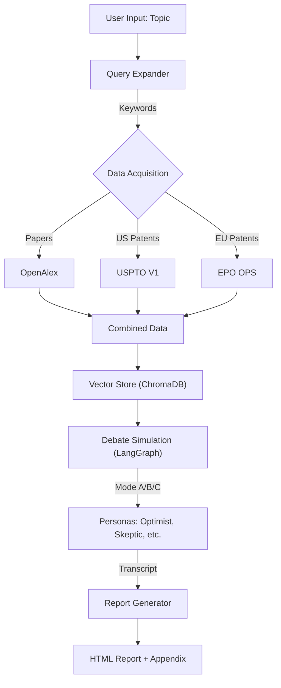

# Virtual Tech Experts & R&D System (VTE-R&D) V2.2

## Overview

VTE-R&D is an advanced AI agent system designed to automate technical research and strategy formulation. It autonomously gathers scientific papers and patents, debates the findings using diverse personas (Optimist, Skeptic, Competitor, Regulator), and generates a comprehensive HTML report with a full debate transcript.

## Key Features (V2.2 Updates)

- **Multi-Source Data Acquisition**:
  - **OpenAlex**: Academic papers (via API).
  - **PatentsView (USPTO)**: US Patents (API Key required).
  - **EPO (European Patent Office)**: European Patents (API Key required).
- **Secure Configuration**: API keys are managed safely via `.env`.
- **Intelligent Query Expansion**: Converts broad topics into precise boolean search queries using LLMs.
- **Advanced Debate Graph**:
  - **Mode A (Sequential)**: Propose -> Critique -> Synthesize.
  - **Mode B (Parallel)**: Simultaneous critique from Competitor, Skeptic, and Regulator.
  - **Mode C (Consensus)**: Back-and-forth iteration to reach agreement.
- **Real-Time Visibility**: Live streaming of debate arguments to the terminal.
- **Detailed Reporting**: Generates formatted HTML reports with data statistics and a full, styled debate transcript appendix.
- **Customizable Models**: Supports Ollama local models and cloud endpoints (e.g., DeepSeek).

## Prerequisites

- Python 3.10+
- [Ollama](https://ollama.ai/) installed and running.
- API Keys for USPTO/EPO (optional but recommended for full data coverage).

## Installation

1. **Clone the repository**:

   ```bash
   git clone <repo_url>
   cd 260205_VirtualTechExperts_Ollama
   ```

2. **Install Dependencies**:

   ```bash
   pip install -r requirements.txt
   ```

3. **Configure Environment**:
   - Rename `.env.example` (or create new) to `.env`:

     ```bash
     USPTO_API_KEY=your_key_here
     EPO_CONSUMER_KEY=your_key_here
     EPO_CONSUMER_SECRET=your_secret_here
     ```

   - Edit `config/config.yaml` to set your preferred Ollama models and debate rules.

## Usage

Run the main script with your research topic:

```bash
python main.py "Liquid Cooling for Data Centers" --mode a
```

### Arguments

- `topic`: The research subject (e.g., "Generative AI", "Solid State Batteries").
- `--mode`: Debate structure.
  - `a`: Sequential (Standard)
  - `b`: Parallel (Comprehensive)
  - `c`: Consensus (Deep Dive)
- `--turn`: (Optional) Override maximum number of turns (e.g., `--turn 5`).

### Reuse Expert Knowledge (New in V2.3)

Skip data collection and reuse an existing Expert Knowledge Base:

1. **List Saved Experts**:

   ```bash
   python main_reuse.py --list
   ```

2. **Reuse an Expert**:

   ```bash
   python main_reuse.py --expert_id exp_12a1de9c --mode b
   ```

3. **Delete an Expert**:

   ```bash
   python main_reuse.py --delete exp_12a1de9c
   ```

## System Architecture

1. **Layer 1: Data Acquisition**
   - Expands user query.
   - Fetches global docs from OpenAlex, USPTO, EPO.
2. **Layer 2: Intelligence Engine**
   - Vectorizes documents (ChromaDB + Ollama Embeddings).
   - Creates an Expert Knowledge Base.
3. **Layer 3: Debate Simulation (LangGraph)**
   - Personas (Optimist, Skeptic, etc.) retrieve evidence from the Vector Store.
   - Agents debate the topic, citing specific papers/patents.
4. **Layer 4: Reporting**
   - Summarizes the debate into a strategic executive report (HTML).
   - Appends the full, styled transcript for reference.

### System Flow



## Customization

- **Personas**: Modify `config/personas.yaml` to change agent personalities (e.g., "Elon Musk style" vs "Conservative Engineer").
- **Models**: Change LLMs in `config/config.yaml` (supports any Ollama-compatible model).
