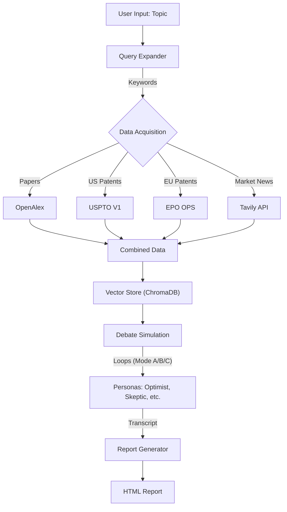
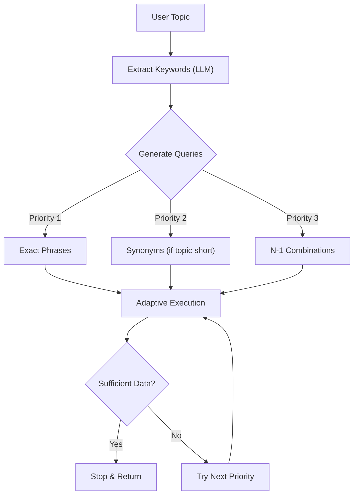

# Virtual Tech Experts & R&D System (VTE-R&D) V2.7

## Overview

VTE-R&D is an advanced AI agent system designed to automate technical research and strategy formulation. It autonomously gathers scientific papers, patents, and **real-time market news**, debates the findings using diverse personas (Optimist, Skeptic, Competitor, Regulator), and generates a comprehensive HTML report with a full debate transcript.

## Key Features (V2.7 Updates)

- **Multi-Source Data Acquisition**:
  - **OpenAlex**: Academic papers (via API).
  - **PatentsView (USPTO)**: US Patents.
  - **EPO (European Patent Office)**: European Patents.
  - **Tavily (New)**: Real-time market news and business insights.
- **Intelligent Query Expansion**:
  - **Synonym-Aware**: Automatically generates technical synonyms (e.g., "bio-based" -> "bio-derived").
  - **Adaptive N-1 Strategy**: Prioritizes exact matches, then synonyms, then relaxed queries to maximize recall.
- **Sequential Expert IDs**: Experts are now assigned clean, readable IDs (e.g., `expert_1`, `expert_2`).
- **Detailed Expert Management**: View document breakdown (Articles/Patents/News) for each expert.
- **Turn-Controlled Debate**: Strictly enforce debate length across all modes using `--turn`.
- **Advanced Debate Graph**:
  - **Mode A (Sequential Loop)**: Optimist <-> Skeptic loop.
  - **Mode B (Round Robin)**: Loop through all 4 personas.
  - **Mode C (Consensus)**: Consensus-seeking loop.
- **Reporting**: HTML reports with full transcript and "Data Statistics" breakdown.

## Prerequisites

- Python 3.10+
- [Ollama](https://ollama.ai/) installed and running.
- API Keys:
  - **Tavily** (Required for News).
  - **USPTO/EPO** (Optional but recommended for comprehensive patent search).

## Installation

1. **Clone the repository**:

   ```bash
   git clone <repo_url>
   cd 260205_VirtualTechExperts_Ollama
   ```

2. **Install Dependencies**:

   ```bash
   pip install -r requirements.txt
   ```

3. **Configure Environment**:
   - Create `.env` file:

     ```bash
     USPTO_API_KEY=your_key
     EPO_CONSUMER_KEY=your_key
     EPO_CONSUMER_SECRET=your_secret
     TAVILY_API_KEY=tvly-xxxxxxxxxxxx
     ```

   - Edit `config/config.yaml` to adjust model settings, fetch limits, and `retrieve_top_k`.

## Usage

### 1. Command Line Interface (CLI)

Run the main script with your research topic:

```bash
python main.py "Liquid Cooling for Data Centers" --mode c --turn 5
```

**Arguments:**

- `topic`: The research subject.
- `--mode`:
  - `a`: Sequential Loop (Standard)
  - `b`: Round Robin (Comprehensive)
  - `c`: Consensus (Deep Dive)
- `--turn`: Override maximum turns per persona (e.g., `--turn 5` means 5 rounds *per speaker*).

### 2. Manage Virtual Experts (CLI)

Unified management via `main.py`:

- **List Saved Experts (with Detailed Stats)**:

  ```bash
  python main.py --list
  ```

  *Output Example:*

  ```text
  Expert ID       | Topic                | Art.  | Pat.  | News  | Total
  -----------------------------------------------------------------------
  expert_1        | Hydrogen Generation  | 150   | 50    | 5     | 205
  expert_2        | Agentic AI           | 100   | 0     | 10    | 110
  ```

- **Reuse an Expert**:

  ```bash
  python main.py --expert_id expert_1 --mode b
  ```

- **Delete an Expert**:

  ```bash
  python main.py --delete expert_1
  ```

### 3. 🖥️ Streamlit Web Interface (GUI)

Launch the web-based UI for an interactive experience:

```bash
streamlit run streamlit_app.py
```

**Features:**

- **Sidebar Controls**: Adjust all configuration parameters in real-time.
- **One-Click Workflow**: Enter a topic and click "Run Analysis" to execute the full pipeline.
- **Live Progress**: Watch the analysis progress through all 4 layers.
- **Live Debate Transcript**: View each persona's arguments with color-coded styling.
- **Report Preview & Download**: View and download the HTML report directly in the browser.

| Analysis View | Expert Hub View |
| :---: | :---: |
|  |  |

## System Architecture

1. **Layer 1: Data Acquisition**
   - Expands queries using LLM.
   - Fetches Papers (OpenAlex), Patents (USPTO/EPO), and **News (Tavily)**.
2. **Layer 2: Intelligence Engine**
   - Vectorizes documents into ChromaDB.
   - Assigns sequential IDs (`expert_1`).
3. **Layer 3: Debate Simulation**
   - Agents (Personas) debate utilizing the Vector Store context (`retrieve_top_k` chunks).
   - Loops for `max_turns` rounds based on selected Mode.
4. **Layer 4: Reporting**
   - Generates HTML Report + Styled Transcript.

### System Flow Diagram



### Intelligent Query Expansion Logic

The system uses a sophisticated **Adaptive N-1 Strategy** to maximize relevant data retrieval while minimizing noise.



## Configuration (`config.yaml`)

- **Data Acquisition**: Set `fetch_limit` for OpenAlex, USPTO, EPO, and **Tavily**.
- **Intelligence**: Set `retrieve_top_k` (context depth).
- **Debate Rules**: Set `max_turns_per_persona` and `max_tokens_per_turn`.
