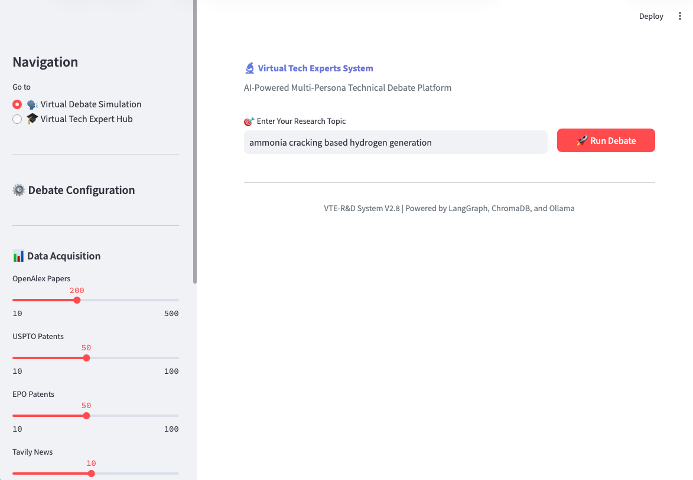
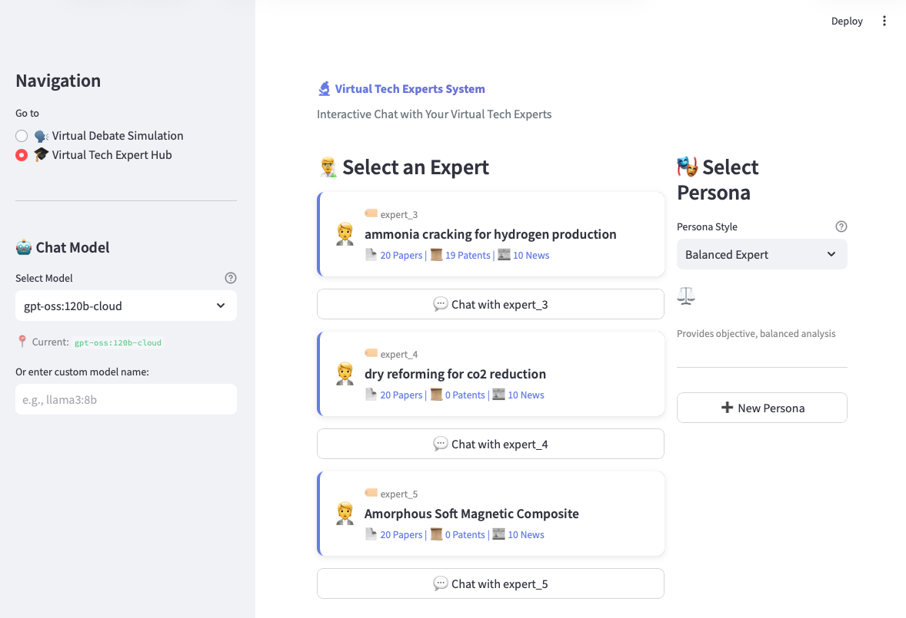
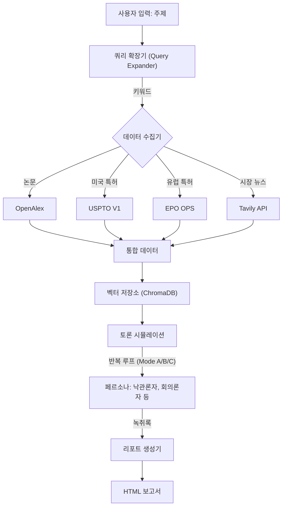

# 가상 기술 전문가 및 R&D 시스템 (VTE-R&D) V2.7

## 개요 (Overview)

VTE-R&D는 기술 조사 및 전략 수립 프로세스를 자동화하기 위해 설계된 첨단 AI 에이전트 시스템입니다. 이 시스템은 과학 논문(OpenAlex), 특허(USPTO/EPO), 그리고 **실시간 시장 뉴스(Tavily)**를 자율적으로 수집하고, 다양한 페르소나(낙관론자, 회의론자, 경쟁자, 규제 당국)를 통해 발견된 정보를 토론하며, 최종적으로 전체 토론 녹취록이 포함된 종합 HTML 보고서를 생성합니다.

## 핵심 기능 (V2.7 업데이트)

- **다중 소스 데이터 수집 (Multi-Source Data Acquisition)**:
  - **OpenAlex**: 학술 논문 (API 연동).
  - **PatentsView (USPTO)**: 미국 특허.
  - **EPO (유럽특허청)**: 유럽 특허.
  - **Tavily (New)**: 실시간 시장 뉴스 및 비즈니스 인사이트.
- **지능형 쿼리 확장 (Intelligent Query Expansion)**:
  - **동의어 인식 (Synonym-Aware)**: 기술적 동의어를 자동 생성하여 검색 (예: "bio-based" -> "bio-derived").
  - **적응형 N-1 전략 (Adaptive N-1 Strategy)**: 정확한 일치 -> 동의어 -> 완화된 쿼리 순으로 검색하여 재현율(Recall)을 극대화.
- **순차적 전문가 ID**: 전문가들에게 읽기 쉬운 ID(예: `expert_1`, `expert_2`)를 부여하여 관리 용이성 증대.
- **상세 전문가 관리**: 각 전문가별 수집 문서(논문/특허/뉴스) 현황을 상세히 조회 가능.
- **발언 턴(Turn) 제어**: `--turn` 옵션을 통해 모드에 관계없이 토론 길이를 엄격하게 제어.
- **고도화된 토론 그래프 (Advanced Debate Graph)**:
  - **Mode A (순차 루프)**: 낙관론자 <-> 회의론자 간의 반복 토론.
  - **Mode B (라운드 로빈)**: 4명의 모든 페르소나가 순차적으로 참여.
  - **Mode C (합의 도출)**: 합의에 도달하기 위한 심층 토론 루프.
- **리포팅**: 전체 녹취록과 "데이터 통계"가 포함된 HTML 보고서 생성.

## 사전 요구 사항 (Prerequisites)

- Python 3.10 이상
- [Ollama](https://ollama.ai/) 설치 및 실행 중일 것.
- API 키:
  - **Tavily** (뉴스 검색을 위해 필수).
  - **USPTO/EPO** (포괄적인 특허 검색을 위해 권장).

## 설치 (Installation)

1. **저장소 복제**:

   ```bash
   git clone <repo_url>
   cd 260205_VirtualTechExperts_Ollama
   ```

2. **의존성 패키지 설치**:

   ```bash
   pip install -r requirements.txt
   ```

3. **환경 설정**:
   - `.env` 파일을 생성합니다:

     ```bash
     USPTO_API_KEY=your_key
     EPO_CONSUMER_KEY=your_key
     EPO_CONSUMER_SECRET=your_secret
     TAVILY_API_KEY=tvly-xxxxxxxxxxxx
     ```

   - `config/config.yaml` 파일을 편집하여 모델 설정, 수집 제한(fetch limits), `retrieve_top_k` 등을 조정합니다.

## 사용법 (Usage)

### 1. 커맨드 라인 인터페이스 (CLI)

연구 주제를 입력하여 메인 스크립트를 실행합니다:

```bash
python main.py "Liquid Cooling for Data Centers" --mode c --turn 5
```

**인자 설명 (Arguments):**

- `topic`: 연구 주제.
- `--mode`:
  - `a`: 순차 루프 (기본)
  - `b`: 라운드 로빈 (포괄적 토론)
  - `c`: 합의 도출 (심층 분석)
- `--turn`: 페르소나당 최대 발언 횟수 재정의 (예: `--turn 5`는 화자당 5번 발언).

### 2. 가상 전문가 관리 (CLI)

`main.py`를 통해 통합 관리할 수 있습니다:

- **저장된 전문가 목록 조회 (상세 통계 포함)**:

  ```bash
  python main.py --list
  ```

  *출력 예시:*

  ```text
  Expert ID       | Topic                | Art.  | Pat.  | News  | Total
  -----------------------------------------------------------------------
  expert_1        | Hydrogen Generation  | 150   | 50    | 5     | 205
  expert_2        | Agentic AI           | 100   | 0     | 10    | 110
  ```

- **기존 전문가 재사용**:

  ```bash
  python main.py --expert_id expert_1 --mode b
  ```

- **전문가 삭제**:

  ```bash
  python main.py --delete expert_1
  ```

### 3. 🖥️ Streamlit 웹 인터페이스 (GUI)

대화형 경험을 위해 웹 기반 UI를 실행합니다:

```bash
streamlit run streamlit_app.py
```

**주요 기능:**

- **사이드바 제어**: 모든 설정 매개변수를 실시간으로 조정 가능.
- **원클릭 워크플로우**: 주제를 입력하고 "Run Analysis" 버튼만 누르면 전체 파이프라인 실행.
- **실시간 진행 상황**: 4단계(Layer)의 진행 상황을 실시간으로 확인.
- **라이브 토론 스크립트**: 각 페르소나의 주장을 색상별로 구분하여 실시간 스트리밍.
- **보고서 미리보기 및 다운로드**: 브라우저에서 HTML 보고서를 바로 확인하고 다운로드.

| 분석 화면 (Analysis View) | 전문가 허브 화면 (Expert Hub View) |
| :---: | :---: |
|  |  |

## 시스템 아키텍처 (System Architecture)

1. **Layer 1: 데이터 수집 (Data Acquisition)**
   - LLM을 사용하여 검색 쿼리를 확장합니다.
   - 논문(OpenAlex), 특허(USPTO/EPO), **뉴스(Tavily)**를 전 세계 소스에서 수집합니다.
2. **Layer 2: 지능 엔진 (Intelligence Engine)**
   - 문서를 벡터화하여 ChromaDB에 저장합니다.
   - 순차적 ID(`expert_1`)를 부여하여 전문가 지식베이스를 생성합니다.
3. **Layer 3: 토론 시뮬레이션 (Debate Simulation)**
   - 에이전트(페르소나)들이 벡터 저장소의 맥락(`retrieve_top_k`)을 활용하여 토론합니다.
   - 선택된 모드에 따라 지정된 라운드(`max_turns`)만큼 루프를 돕니다.
4. **Layer 4: 리포팅 (Reporting)**
   - HTML 보고서 및 스타일이 적용된 녹취록을 생성합니다.

### 시스템 흐름도 (System Flow Diagram)



### 지능형 쿼리 확장 로직 (Intelligent Query Expansion Logic)

이 시스템은 관련 데이터 수집을 극대화하면서도 노이즈를 최소화하기 위해 정교한 **적응형 N-1 전략(Adaptive N-1 Strategy)**을 사용합니다.

```mermaid
graph TD
    Start[사용자 주제] --> Ext["키워드 추출 (LLM)"]
    Ext --> Gen{쿼리 생성 전략}
    
    Gen -->|1순위| Exact["정확한 구문 (Exact Phrases)"]
    Gen -->|2순위| Syn["동의어 (Synonyms) <br/> *주제가 짧을 경우"]
    Gen -->|3순위| Relax["N-1 조합 (N-1 Combinations)"]
    
    Exact & Syn & Relax --> Exec[적응형 실행 (Adaptive Execution)]
    
    Exec --> Check{데이터 충분?}
    Check -->|Yes| End[종료 및 반환]
    Check -->|No| Next[다음 순위 실행]
    Next --> Exec
```

## 설정 (`config.yaml`)

- **데이터 수집**: OpenAlex, USPTO, EPO, **Tavily**의 `fetch_limit`(수집 개수 제한) 설정.
- **지능 엔진**: `retrieve_top_k`(문맥 깊이) 설정.
- **토론 규칙**: `max_turns_per_persona`(화자당 발언 수) 및 `max_tokens_per_turn` 설정.
