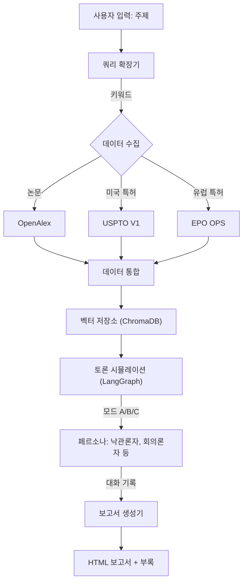

# 가상 기술 전문가 및 R&D 시스템 (VTE-R&D) V2.2

## 개요

VTE-R&D는 기술 연구 및 전략 수립을 자동화하기 위해 설계된 고급 AI 에이전트 시스템입니다. 이 시스템은 과학 논문과 특허를 자율적으로 수집하고, 다양한 페르소나(낙관론자, 회의론자, 경쟁자, 규제 담당자)를 통해 결과를 토론하며, 전체 토론 기록이 포함된 포괄적인 HTML 보고서를 생성합니다.

## 주요 기능 (V2.2 업데이트)

- **다중 소스 데이터 수집**:
  - **OpenAlex**: 학술 논문 (API 연동).
  - **PatentsView (USPTO)**: 미국 특허 (API 키 필요).
  - **EPO (유럽 특허청)**: 유럽 특허 (API 키 필요).
- **보안 설정**: API 키는 `.env` 파일을 통해 안전하게 관리됩니다.
- **지능형 쿼리 확장**: LLM을 사용하여 사용자의 광범위한 주제를 정밀한 불리언 검색 쿼리로 변환합니다.
- **고급 토론 그래프 (LangGraph)**:
  - **모드 A (순차적)**: 제안 -> 비판 -> 종합.
  - **모드 B (병렬적)**: 경쟁자, 회의론자, 규제 담당자의 동시 비판.
  - **모드 C (합의형)**: 합의에 도달하기 위한 반복적인 상호작용.
- **실시간 가시성**: 토론 내용이 터미널에 실시간으로 스트리밍됩니다.
- **상세 보고서**: 데이터 통계와 스타일이 적용된 전체 토론 기록 부록이 포함된 HTML 보고서를 생성합니다.
- **모델 사용자 정의**: Ollama 로컬 모델 및 클라우드 엔드포인트(예: DeepSeek)를 지원합니다.

## 필수 조건

- Python 3.10 이상
- [Ollama](https://ollama.ai/) 설치 및 실행 중.
- USPTO/EPO API 키 (선택 사항이지만 전체 데이터 커버리지를 위해 권장).

## 설치 방법

1. **저장소 복제**:

   ```bash
   git clone <repo_url>
   cd 260205_VirtualTechExperts_Ollama
   ```

2. **의존성 설치**:

   ```bash
   pip install -r requirements.txt
   ```

3. **환경 설정**:
   - `.env.example` 파일의 이름을 `.env`로 변경(또는 새로 생성)하고 키를 입력합니다:

     ```bash
     USPTO_API_KEY=your_key_here
     EPO_CONSUMER_KEY=your_key_here
     EPO_CONSUMER_SECRET=your_secret_here
     ```

   - `config/config.yaml` 파일을 편집하여 선호하는 Ollama 모델과 토론 규칙을 설정합니다.

## 사용 방법

연구 주제와 함께 메인 스크립트를 실행합니다:

```bash
python main.py "Liquid Cooling for Data Centers" --mode a
```

### 인자 (Arguments)

- `topic`: 연구 주제 (예: "Generative AI", "Solid State Batteries").
- `--mode`: 토론 구조.
  - `a`: 순차적 (표준)
  - `b`: 병렬적 (포괄적)
  - `c`: 합의형 (심층 분석)
- `--turn`: (선택) 최대 토론 턴 수 재정의 (예: `--turn 5`).

### 전문가 지식 재사용 (V2.3 신기능)

데이터 수집 과정을 건너뛰고 기존 전문가 지식 베이스를 재사용할 수 있습니다:

1. **저장된 전문가 목록 조회**:

   ```bash
   python main_reuse.py --list
   ```

2. **전문가 재사용 실행**:

   ```bash
   python main_reuse.py --expert_id exp_12a1de9c --mode b
   ```

3. **전문가 삭제 (삭제)**:

   ```bash
   python main_reuse.py --delete exp_12a1de9c
   ```

## 시스템 아키텍처

1. **Layer 1: 데이터 수집**
   - 사용자 쿼리 확장.
   - OpenAlex, USPTO, EPO에서 글로벌 문서 수집.
2. **Layer 2: 인텔리전스 엔진**
   - 문서 벡터화 (ChromaDB + Ollama Embeddings).
   - 전문가 지식 베이스 생성.
3. **Layer 3: 토론 시뮬레이션 (LangGraph)**
   - 페르소나(낙관론자, 회의론자 등)가 벡터 저장소에서 증거를 검색.
   - 에이전트들이 특정 논문/특허를 인용하며 주제에 대해 토론.
4. **Layer 4: 보고서 작성**
   - 토론 내용을 전략적 임원 보고서(HTML)로 요약.
   - 참조를 위해 스타일이 적용된 전체 토론 기록을 부록으로 첨부.

### 시스템 흐름도



## 사용자 정의

- **페르소나**: `config/personas.yaml`을 수정하여 에이전트의 성격을 변경할 수 있습니다 (예: "일론 머스크 스타일" vs "보수적 엔지니어").
- **모델**: `config/config.yaml`에서 LLM을 변경할 수 있습니다 (모든 Ollama 호환 모델 지원).
